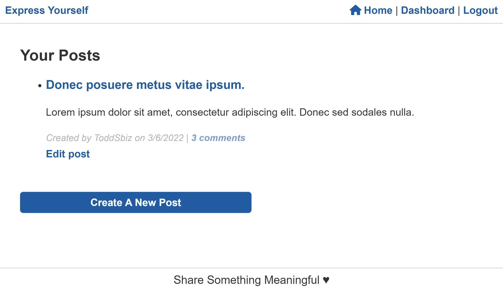

# express-yourself

## Description

CMS fullstack website where users can create a profile that allows them to write, edit, and delete posts and comments.

## Preview

[View Deployed Site](https://express-yourself-01.herokuapp.com/)

## Table of Contents

- [Installation](#Installation)
- [Usage](#Usage)
- [Credits](#Credits)
- [License](#License)
- [Contributions](#Contributions)
- [Test](#Test)
- [Questions](#Questions)

## Installation

The user will visit the deployed site, and after creating an account can participate in Express Yourself as a member of the EY community, writing and responding to posts. If you are a developer that would like to use the project for your own creation, please download/clone code directly from GitHub or fork the repository.

## Usage

Visit site to login and create content!

If you intend to build a similar site or replicate using my source code, be sure to install and use the following npm:

* express-handlebars npm package to use Handlebars.js for Views
* MySQL2 and 
* Sequelize npm to connect to db for models
and 
* Express.js API for controllers

Additionally need 
* dotenv npm for .env variables
* bcrypt npm to hash passwords
* express-session and 
* connect-session-sequelize npm for authentication

## Credits

📢 I want to thank Harrison @[nightmarefails](https://github.com/nightmarefails) for his time and help with troubleshooting a Handlebars issue.

Thank you also to Kyler @[kyler-Mclachlan](https://github.com/kyler-Mclachlan/) for pointing me to the resource on W3Docs for handling idle-time / logouts, see more below.

Helpful resources:

- [Handlebars](https://www.npmjs.com/package/express-handlebars)
- [MySQL](https://www.npmjs.com/package/mysql2)
- [Sequelize](https://www.npmjs.com/package/sequelize)
- [dotenv](https://www.npmjs.com/package/dotenv)
- [bcrypt](https://www.npmjs.com/package/bcrypt)
- [Express-session](https://www.npmjs.com/package/express-session)
- [Express-session-sequelize](https://www.npmjs.com/package/connect-session-sequelize)
- [Heroku](https://devcenter.heroku.com/)
- [W3docs -- "How to Detect Idle Time in JavaScript" ](https://www.w3docs.com/snippets/javascript/how-to-detect-idle-time-in-javascript.html)

  ## License

  

  ### MIT License

  Copyright 2022 Claire Rosenfrisk

  Permission is hereby granted, free of charge, to any person obtaining a copy of this software and associated documentation files (the "Software"), to deal in the Software without restriction, including without limitation the rights to use, copy, modify, merge, publish, distribute, sublicense, and/or sell copies of the Software, and to permit persons to whom the Software is furnished to do so, subject to the following conditions:

  The above copyright notice and this permission notice shall be included in all copies or substantial portions of the Software.

  THE SOFTWARE IS PROVIDED "AS IS", WITHOUT WARRANTY OF ANY KIND, EXPRESS OR IMPLIED, INCLUDING BUT NOT LIMITED TO THE WARRANTIES OF MERCHANTABILITY, FITNESS FOR A PARTICULAR PURPOSE AND NONINFRINGEMENT. IN NO EVENT SHALL THE AUTHORS OR COPYRIGHT HOLDERS BE LIABLE FOR ANY CLAIM, DAMAGES OR OTHER LIABILITY, WHETHER IN AN ACTION OF CONTRACT, TORT OR OTHERWISE, ARISING FROM, OUT OF OR IN CONNECTION WITH THE SOFTWARE OR THE USE OR OTHER DEALINGS IN THE SOFTWARE.

  ## Contributions

  Users can contact the creator directly via email or @crosenfrisk on GitHub to make suggestions for future iterations of the website/application.

  ## Test

  Run `npm run seeds` in command line, and then run `npm start` to view dummy data on site.

  ## Questions

  If you have any questions about this project, please contact me directly at claire.rosenfrisk@gmail.com. You can view more of my work on
   [My GitHub Profile](https://github.com/crosenfrisk).
